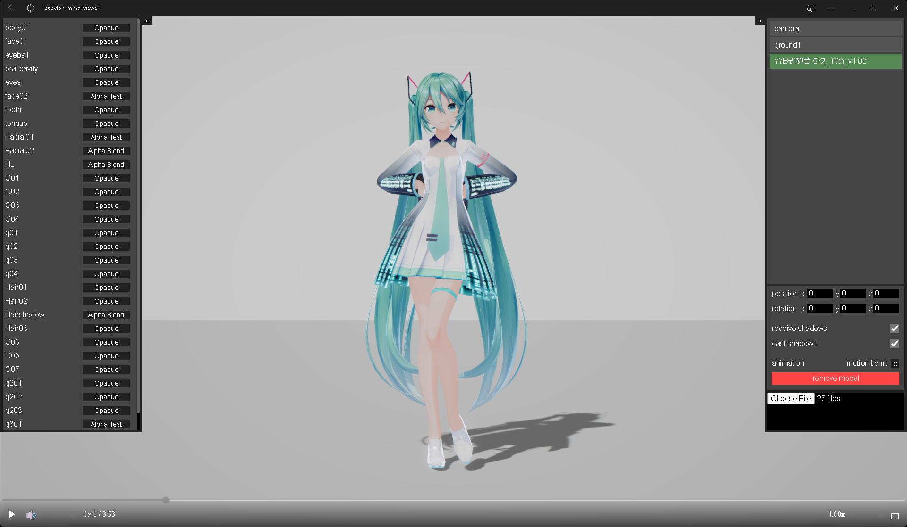

# babylon-mmd-viewer

MMD viewer powered by [Babylon.js](https://github.com/BabylonJS/Babylon.js) and [babylon-mmd](https://github.com/noname0310/babylon-mmd)

**you can try it [here](https://noname0310.github.io/babylon-mmd-viewer)**

## Specification

### Supported Format

**Model** -  PMX, PMD, BPMX

**Motion** - VMD, VPD, BVMD

### Features

Import model on local file system

Multiple models

Audio playback
